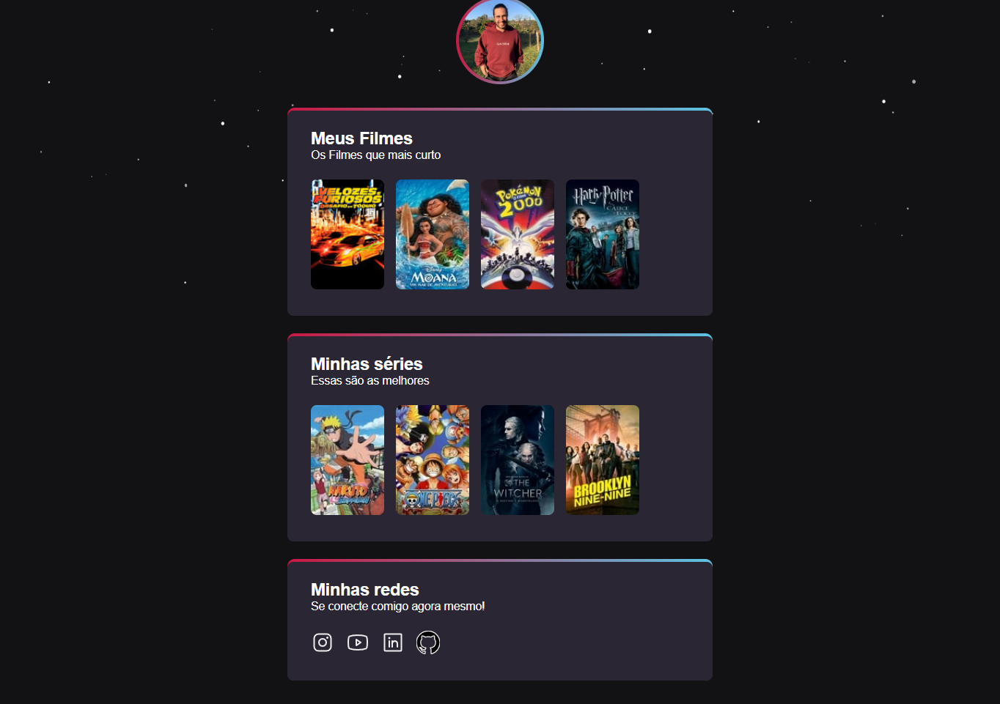

# NLW Filmes e Séries 

>Trilha Explorer Desafio Extra

Projeto construído do evento Next Level Week da Rocketseat.

[🔗 Clique aqui para acessar](https://luprime.github.io/nlw-flimes-explorer)

## 👨‍💻 Tecnologia

- HTML
- CSS
- Git e Github

## 💭 O que aprendi?

Neste projeto, tive que recriar o primeiro projeto feito sobre eSports, porém desta vez o tema era filmes e séries favoritas, e alguns de seus elementos foram alterados, como fundo das bordas, fundo geral, tamanho dos icones, entre outras coisas.
Este segundo projeto serviu para treino e para fazer lembrar tudo que foi aprendido na NLW que se encerrou domingo 18/09/2022.

## 📚 Contato

lucas.primati@hotmail.com